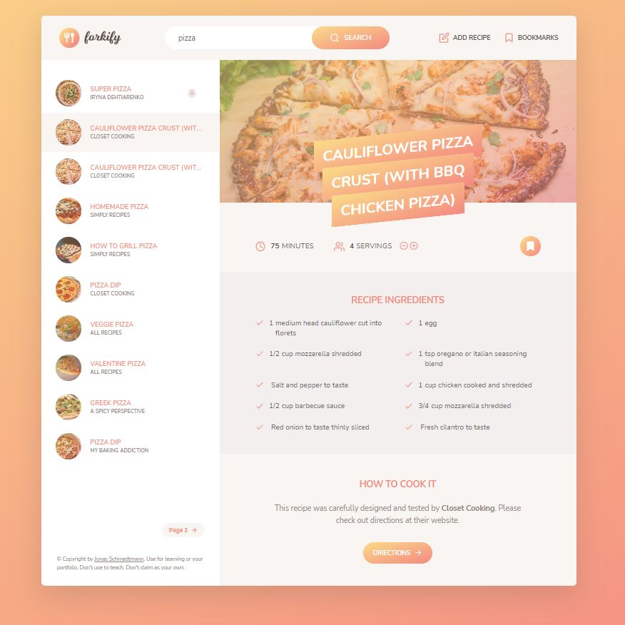
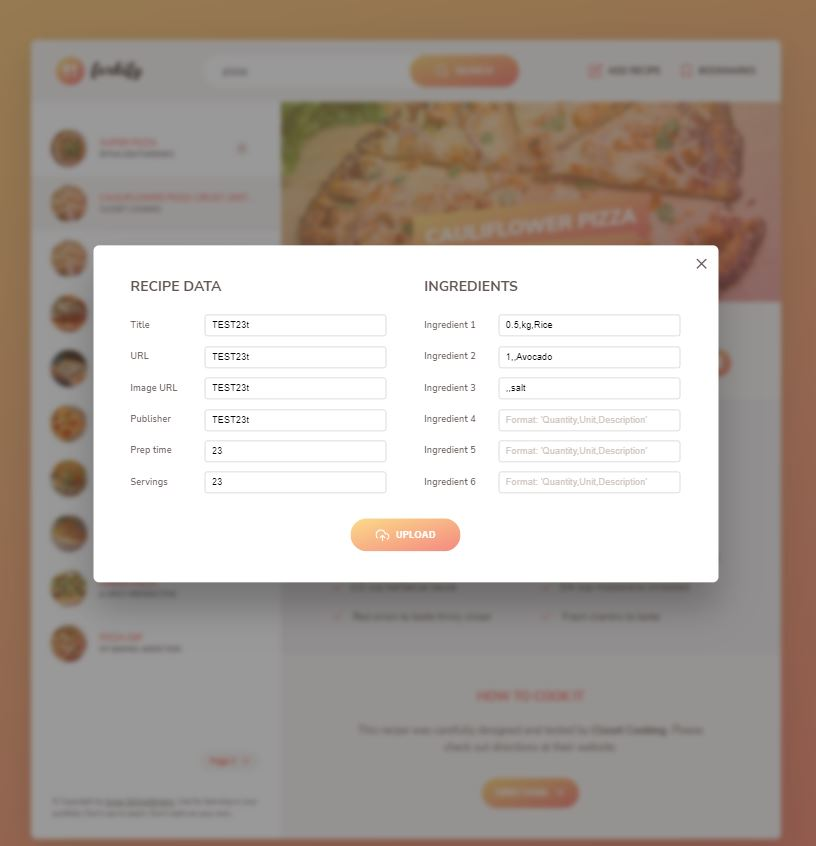

# Forkify Project

Recipe application with custom recipe uploads.

This project was built with the author in an online course "The Complete JavaScript Course 2023: From Zero to Expert!" from Udemy.

## Table of contents

- [Overview](#overview)
  - [Screenshot](#screenshot)
  - [Links](#links)
- [My process](#my-process)
  - [Built with](#built-with)
  - [What I learned](#what-i-learned)
  - [Useful resources](#useful-resources)

## Overview

Users should be able to:

- Currently, this version of the application is only for desktop users, I will develop it also to view the optimal layout for each of the website's pages depending on their device's screen size
- See hover states for all interactive elements on the page
- View each page and be able to toggle between the tabs to see new information
- Search for some recipes from the API
- Bookmark the recipes they like
- Add new recipes of their own
- Everything is stored in Local Storage

### Screenshot





### Links

- Live Site URL: [Live site from netlify](https://forkify-iryna.netlify.app/)

## My process

### Built with

- Semantic HTML5 markup
- CSS custom properties
- Flexbox
- CSS Grid
- SCSS
- [Forkify API](https://forkify-api.herokuapp.com/) - Recipe API
- [Fracty](https://www.npmjs.com/package/fracty) - Fracty is a decimal-to-fraction conversion module
- [Parcel](https://parceljs.org/) - For web packaging program
- [Core-js](https://www.npmjs.com/package/core-js) - Modular standard library for JavaScript

### What I learned

I learned about:

- The Model-View-Controller(MVC) architecture

- Publisher-subscriber pattern in MVC

- building process in modern JS (using Parsel and NPM scripts).

- throwing errors manually:

```js
try {
	...
if (ingArr.length !== 3)
          throw new Error(
            'Wrong ingredient format! Please use the correct format ;)'
          );
  } catch (err) {
    throw err;
  }
```

### Useful resources

- [The Complete JavaScript Course 2023: From Zero to Expert!](https://www.udemy.com/course/the-complete-javascript-course/) - This is the course during which I built this project, I also learned a lot of useful things. The author explains everything very thoroughly, very deeply explaining complicated things.
